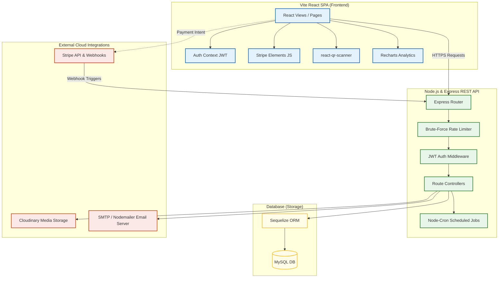
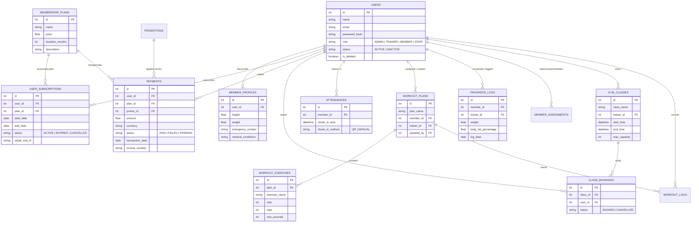

# 🏋️‍♂️ Enterprise Gym Management System with Automated Billing & Digital Check-In

[](https://nodejs.org/)
[](https://react.dev/)
[](https://tailwindcss.com/)
[](https://mysql.com/)
[](https://stripe.com/)
[](LICENSE)

A comprehensive, production-ready enterprise web application designed to streamline gym operations, eliminate membership revenue leakage, automate recurring billing, schedule classes, track attendance, and provide interactive analytics. 

Built with a robust, high-performance Node.js & Express REST API, standard database indexing, and a modern, responsive React 19 single-page application styled using Tailwind CSS v4 and Framer Motion animations.

---

## 📖 Table of Contents
1. [Core Features](#-core-features)
2. [System Architecture & Flow](#-system-architecture--flow)
3. [Database Entity-Relationship Diagram (ERD)](#-database-entity-relationship-diagram-erd)
4. [Role-Based Access Control (RBAC)](#-role-based-access-control-rbac)
5. [Key Technical Integrations](#-key-technical-integrations)
6. [Tech Stack Details](#-tech-stack-details)
7. [Prerequisites & Environment Variables](#-prerequisites--environment-variables)
8. [Installation & Local Setup](#-installation--local-setup)
9. [Running the Application](#-running-the-application)
10. [Database Management & Optimizations](#-database-management--optimizations)
11. [Project Lifecycle & PM Governance](#-project-lifecycle--pm-governance)
12. [License](#-license)

---

## 🚀 Core Features

### 👤 Role-Based Portals (RBAC)
- **Administrators**: Control system settings, manage memberships, oversee trainers & staff, adjust pricing, and generate dynamic reports.
- **Trainers**: Manage client assignments, track workouts & health metrics, set availability schedules, and build workout plans.
- **Members**: Book gym classes via an interactive calendar, manage Stripe subscriptions, check-in using secure QR codes, and review workout logs.
- **Front-Desk Staff**: Handle manual member registrations, verify digital QR check-ins, and manage daily class schedules.

### 💳 Stripe Automated Billing & PDF Invoicing
- Secure credit card processing using **Stripe Checkout Sessions**.
- Asynchronous webhook integration processing real-time subscription activations, cancellations, and payment failures.
- Auto-generation of professional **PDF Receipts and Invoices** on the member portal (using jsPDF & html2canvas).

### 📷 WebRTC QR-Code Attendance System
- Member check-ins via a built-in camera scanner component.
- Real-time verification checks on subscription status.
- Fallback manual check-in tools for administrative staff.

### 📊 Real-Time Analytics & Report Engine
- Interactive dashboards with charts for revenue, member growth, class capacity, and trainer metrics (using Recharts).
- **Attendance Heatmaps** demonstrating gym capacity peaks by day and time.
- Dynamic report exporting to **CSV & PDF** files.

### 📅 Class Booking & Scheduling
- Full visual calendar integration (using React Big Calendar).
- Capacity thresholds and automated waitlist tracking.
- Trainer availability tracking to avoid scheduling double-bookings.

---

## 🏗️ System Architecture & Flow

The system employs a clear separation of concerns, decoupling the frontend SPA from the backend REST API, and integrating with external microservices:



---

## 🗄️ Database Entity-Relationship Diagram (ERD)

The database schema utilizes standard foreign key relationships optimized with custom indexing rules to allow scalable querying:



---

## 🛡️ Role-Based Access Control (RBAC)

The application enforces security scopes on the router and layout levels. Users are automatically redirected to their specific dashboards upon login.

| Feature Module | Admin | Trainer | Staff | Member |
| :--- | :---: | :---: | :---: | :---: |
| **System Settings Configuration** | ✅ | ❌ | ❌ | ❌ |
| **Membership Plan Management** | ✅ | ❌ | ❌ | ❌ |
| **Financial Revenue & Audit Logs** | ✅ | ❌ | ❌ | ❌ |
| **Trainer / Client Assignments** | ✅ | ❌ | ❌ | ❌ |
| **Staff & Trainer Directory Control**| ✅ | ❌ | ❌ | ❌ |
| **Workout Plan Architect** | ✅ | ✅ | ❌ | ❌ |
| **Member Progress Logging** | ✅ | ✅ | ❌ | ❌ |
| **Class Booking Calendar** | ✅ | ✅ | ✅ | ✅ |
| **Manual Member Registration** | ✅ | ❌ | ✅ | ❌ |


---

## 🔌 Key Technical Integrations

### 1. Stripe Checkout Flow & Webhook Syncing
Members choose their subscription tier on the client app, which communicates with the backend to create a Stripe checkout session. Once payment completes:
- Stripe transmits an asynchronous `checkout.session.completed` or `invoice.payment_succeeded` request to the backend webhook endpoint.
- The webhook verifies the signature using `stripe.webhooks.constructEvent()` for security.
- The system automatically triggers the updates to the corresponding `user_subscriptions` and logs the payment transaction in the database.

### 2. Live WebRTC QR Code Scanner
The member portal features a QR code generator containing the user's encoded validation payload.
- The reception desk runs the frontend scanning interface (`@yudiel/react-qr-scanner`) via a standard webcam or USB QR reader.
- It parses the token, queries the attendance API, checks if the member has a valid active subscription, and saves the attendance check-in timestamp.
- On success, visual alerts display the check-in confirmation within 2 seconds.

### 3. Automated System Tasks (Cron Services)
The server runs background workers using `node-cron` to execute operational cleanup:
- **Subscription Auditing**: Runs daily at midnight to scan `user_subscriptions` and transition expired memberships to the `EXPIRED` status, changing users' status to `INACTIVE`.
- **System Metrics Cleanup**: Compresses outdated log assets and checks database health metrics.

---

## 🛠️ Tech Stack Details

### Client-Side (Frontend)
- **Core Framework**: React 19 (Vite compilation engine)
- **Styling**: Tailwind CSS v4 & PostCSS 8
- **Transitions & Animations**: Framer Motion 12
- **State Management**: React Context API & Custom Custom hooks
- **Router**: React Router DOM 7
- **HTTP Client**: Axios (configured with interceptors for JWT injection)
- **Visualization**: Recharts 3 (interactive line, bar, and pie charts)
- **Calendar Engine**: React Big Calendar 1
- **File Utilities**: jsPDF 4, jsPDF-AutoTable 5, html2canvas 1
- **UI Notifications**: React Hot Toast 2

### Server-Side (Backend API)
- **Runtime**: Node.js v18+
- **Web Server Framework**: Express.js v5
- **ORM**: Sequelize v6
- **Database Driver**: mysql2 v3
- **Authentication**: jsonwebtoken (JWT) v9, bcrypt v6
- **Asset Storage Manager**: Multer v2 & Cloudinary SDK
- **Task Runner**: node-cron v4
- **Email Dispatcher**: Nodemailer v7
- **Brute-Force Protection**: express-rate-limit v8

---

## ⚙️ Prerequisites & Environment Variables

Ensure you have the following installed locally:
- **Node.js** (v18.x or above)
- **MySQL Server** (v8.x or above)

### 1. Backend Environment Variables (`backend/.env`)
Create a `.env` file inside the `backend` folder:
```env
PORT=5000
DB_HOST=localhost
DB_PORT=3306
DB_USER=your_db_username
DB_PASSWORD=your_db_password
DB_NAME=gym_management_db

JWT_SECRET=your_jwt_signing_secret_key
JWT_EXPIRES_IN=24h

STRIPE_SECRET_KEY=sk_test_...
STRIPE_WEBHOOK_SECRET=whsec_...

CLOUDINARY_CLOUD_NAME=your_cloudinary_name
CLOUDINARY_API_KEY=your_cloudinary_api_key
CLOUDINARY_API_SECRET=your_cloudinary_secret

EMAIL_USER=your_smtp_sender_email@gmail.com
EMAIL_PASS=your_app_password
```

### 2. Client Environment Variables (`client/.env`)
Create a `.env` file inside the `client` folder:
```env
VITE_API_URL=http://localhost:5000/api
VITE_STRIPE_PUBLISHABLE_KEY=pk_test_...
```

---

## 📦 Installation & Local Setup

### Step 1: Clone the Project
```bash
git clone <repository-url>
cd GYM-Management-System
```

### Step 2: Set up Backend Services
```bash
cd backend
npm install
```
Configure your database connection inside `backend/.env`.

### Step 3: Set up Frontend App
```bash
cd ../client
npm install
```
Configure your VITE variables inside `client/.env`.

### Step 4: Run Database Sync
The database schema will automatically sync models when launching the backend server. If you want to configure optimal indexes, run the indexing script:
```bash
cd ../backend
npm run db:index # or node scripts/setupIndexes.js
```

---

## 🏃‍♂️ Running the Application

### Option A: Development Environment (Nodemon + Vite)

1. **Start the Backend Server (Terminal 1)**:
   ```bash
   cd backend
   npm run dev
   # Server will start on http://localhost:5000
   ```
2. **Start the React Client (Terminal 2)**:
   ```bash
   cd client
   npm run dev
   # App will open on http://localhost:5173
   ```

### Option B: Production Environment

1. **Compile React Frontend Assets**:
   ```bash
   cd client
   npm run build
   # Compiled static assets will output to client/dist
   ```
2. **Start Server**:
   ```bash
   cd ../backend
   npm start
   # Runs server in production mode
   ```

---

## 🎛️ Database Management & Optimizations

The system provides utility tools in the `backend/scripts` folder to support testing, auditing, and maintenance:

### 1. Database Index Setup (`npm run db:index` / `node scripts/setupIndexes.js`)
Builds fast indexing layers for MySQL, dramatically improving fetch query performance during peak gym hours:
- `idx_users_name`, `idx_users_status`, `idx_users_role`, `idx_users_is_deleted` on the `users` table.
- `idx_payments_date`, `idx_payments_status` on the `payments` table.
- `idx_subscriptions_status`, `idx_subscriptions_end_date` on the `user_subscriptions` table.

### 2. Database Factory Reset Sandbox (`npm run db:reset` / `node scripts/factoryReset.js`)
For testing, staging, and demo resets, this script cleans the sandbox space:
- Temporarily disables foreign key constraints (`SET FOREIGN_KEY_CHECKS = 0`).
- Truncates all transactional rows (Payments, Bookings, Attendances, Logs, Member Profiles).
- Deletes all users except the root account having the role `ADMIN`.
- Resets auto-increment indexes to `1` across all tables.

---

## 🤝 Project Lifecycle & PM Governance

This application was delivered using a hybrid **Agile-Waterfall lifecycle** to enforce budget and schedule baselines while remaining highly adaptable during development:

### Milestone Breakdown
- 📅 **Milestone 1**: Project Charter Approved (Week 2)
- 📅 **Milestone 2**: Database Schema Finalized (Week 8)
- 📅 **Milestone 3**: Backend APIs Completed & Certified (Week 14)
- 📅 **Milestone 4**: Payment Integration & Security Audit (Week 21)
- 📅 **Milestone 5**: UAT and Final Handover Completed (Week 26)


---

## 📄 License

Distributed under the ISC License. See `LICENSE` for more information.

---

*Designed and developed to automate enterprise fitness logistics.* 🏋️‍♂️✨
